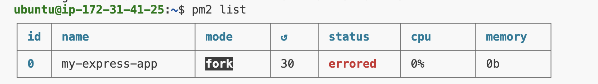

### 連線 instance 的 public IP

#### My Server Public IPv4 address

```
47.128.13.177
```

#### My Server Public IPv4 DNS

```
ec2-47-128-13-177.ap-southeast-1.compute.amazonaws.com
```

#### 透過瀏覽器訪問

```
http://47.128.13.177
```

#### 透過 curl 測試

```
curl http://47.128.13.177
```

### 什麼是 Instance Type？

- Instance type 是在 AWS EC2 中定義的計算資源配置。決定了要運行的實例的硬體性能，比如 CPU、記憶體、存儲和網路資源的大小
- 常見的 instance type 包括：
  - t2.micro：小型實例，1 vCPU，1 GB 記憶體，適合小型應用程式、開發和測試環境
  - m5.large：更高性能的實例，2 vCPU，8 GB 記憶體，適合中型應用和工作負載

### 什麼是 Nginx？有哪些用途與特性？

- Nginx 是一個高效能的 Web 伺服器，最常用來作為反向代理（reverse proxy）、負載均衡器和 HTTP Cache
- 它的主要用途和特性包括：
  - 反向代理：接收用戶的請求，並將其轉發給後端伺服器（如 Express、Django 等）
  - 負載均衡：將流量分散到多個伺服器，以提高可靠性和可用性
  - 靜態內容伺服器：高效能處理靜態文件（如圖片、CSS、JS 文件）
  - 高併發處理：Nginx 使用異步非阻塞架構，能高效處理大量的並發請求，比傳統伺服器（如 Apache）表現更好
  - HTTPS 支持：Nginx 可以用來處理 SSL/TLS 安全連接

### PM2 套件是什麼？有什麼用處？

- PM2 是一個適用於 Node.js 的背景程序管理工具，用來管理、監控和持久化運行的應用程式
- PM2 的用途包括：
  - 背景程序守護：當應用程式崩潰時自動重啟
  - 負載均衡：可以在多核 CPU 上平衡多個應用程式實例
  - 日誌管理：提供便捷的應用日誌監控和分析
  - 自動重啟：當應用程式檔案變更時，PM2 可以自動重啟應用程式
- 類似的工具包括：
  - Forever：另一個背景程序管理工具，專注於使 Node.js 應用永久運行，但功能不如 PM2 強大（如日誌分析和負載均衡）
  - Supervisor：簡單的工具，適合開發過程中監控文件變化，重啟 Node.js 應用
  - PM2 的特點在於其更強大的日誌管理、負載均衡和支援群集模式，使其更適合用於生產環境

### 下文提到的 proxy 是什麼意思？為什麼要透過 Nginx 來 proxy 到 Express 開發的 Web Server？

> 『設定 Nginx，讓他可以 proxy 到這個 Express Server』

- Proxy 在這裡指的是「代理伺服器」，而 reverse proxy 是代理外部請求到後端伺服器的技術。Nginx 作為反向代理會接收來自用戶端的請求，然後將它們轉發到 Express 應用伺服器
- 反向代理 (Reverse Proxy)：Nginx 在這裡作為反向代理，轉發請求到內部的 Express 應用伺服器，並返回結果給客戶端。這樣可以隔離後端伺服器，增加安全性、負載均衡和靈活性
- 正向代理 (Forward Proxy)：用來代理內部網絡向外部資源發送請求的情況，常見於公司或學校的網路環境
- 使用 Nginx 作為反向代理可以減少 Express 直接暴露給網絡，並能夠實現多種優化，例如靜態文件的處理、負載均衡等

### Nginx 設定檔

```
server {
    listen 80;
    server_name 47.128.13.177;

    location / {
        proxy_pass http://localhost:3000;
        proxy_http_version 1.1;
        proxy_set_header Host $host;
    }
}

```

### Security Group 是什麼？用途為何？有什麼設定原則嗎？

- Security Group 是 AWS EC2 的虛擬防火牆，用來控制進出實例的網路流量。可以通過定義允許的進出站規則，來保護實例免受未經授權的訪問
- 設定原則：
  - 最小權限原則：只允許必要的端口和 IP 範圍進行訪問。例如，22（SSH）和 80（HTTP）是最常見的允許端口
  - 限制來源 IP：對於 SSH（22 端口），你應該限制只有你的 IP 地址可以進行連接，增加安全性

### 什麼是 sudo？為什麼有的時候需要加上 sudo，有時候不用？

- sudo 是 "superuser do" 的縮寫，它允許用戶以超級使用者（root）權限來執行特定指令。在 Linux 系統中，一些需要修改系統設置的操作（如安裝軟體、修改系統文件）需要管理員權限，因此需要加上 sudo 來授權
- 有時候不需要使用 sudo 是因為該操作不涉及系統層面的修改，例如編輯用戶自己的文件或運行應用程式

### Nginx 的 Log 檔案在哪裡？你怎麼找到的？怎麼看 Nginx 的 Log？

- 訪問紀錄：/var/log/nginx/access.log
- 錯誤紀錄：/var/log/nginx/error.log
- 可以通過以下指令來查看這些紀錄：

```
sudo tail -f /var/log/nginx/access.log
sudo tail -f /var/log/nginx/error.log
```

- 這些路徑可以在 Nginx 的主配置文件 /etc/nginx/nginx.conf 中找到，通常默認位置已經設置好

### 過程中遭遇的問題



- 使用 pm2 啟動 express ，status 出現 errored
- 解決方法：記得 npm install
- 其他：Nginx 的配置檔案結構感覺蠻複雜，可以花時間去研究

### 列出完成本作業時參考的資料

- [Linux 的檔案權限與目錄配置](https://linux.vbird.org/linux_basic/centos7/0210filepermission.php)
- [Amazon Elastic Compute Cloud Documentation](https://docs.aws.amazon.com/ec2/?icmpid=docs_homepage_featuredsvcs)
- [用 Nginx 伺服器建立反向代理](https://ithelp.ithome.com.tw/articles/10221704)
- [nginx 反向代理設定教學](https://hackmd.io/@shaung08/Bk9xvwN5F)
