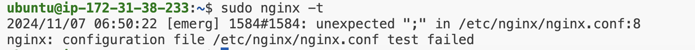
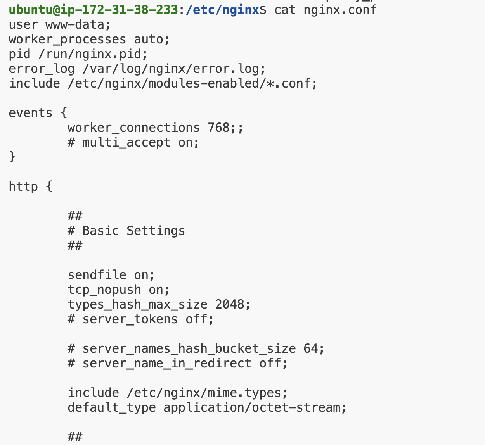
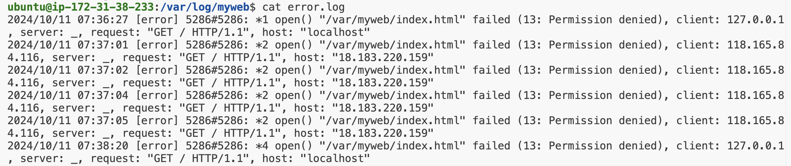
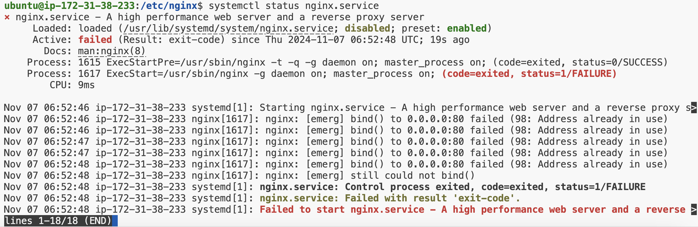
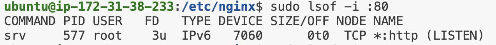
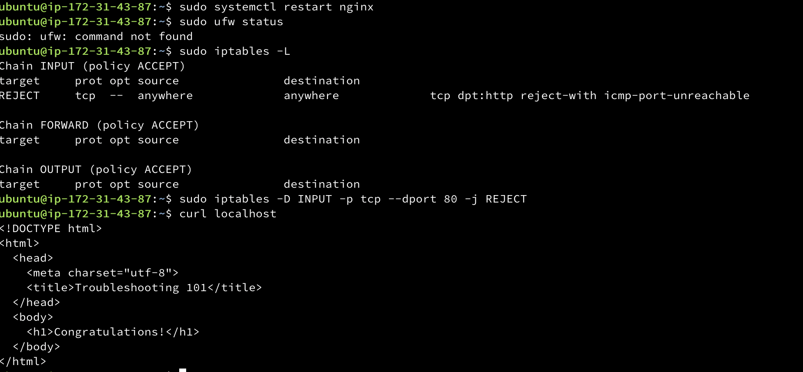

## Troubleshooting Lab - Web Server

### 問題描述
* 連線至 localhost 發生問題
```
curl localhost
```

### 先查看環境與配置
* 檢查 Nginx 配置文件語法
```
sudo nginx -t
```
* error



* 查看 Nginx 的 Config 檔
* Nginx 的主要設定檔通常會放置在 /etc/nginx/nginx.conf
```
cd /etc/nginx/nginx.conf
```



* 發現多了一個 ";"，使用 vim 進入此檔案進行更改
```
sudo vim nginx.conf 
```
* 檢查 conf 語法以確保文件沒有錯誤
```
sudo nginx -t
```
* 重新加載 Nginx 配置
```
sudo systemctl reload nginx
```
* 重啟 Nginx（可選）
```
sudo systemctl restart nginx
```

### 查看 error.log


* 錯誤訊息表示 Nginx 無法讀取 /var/myweb/index.html 文件，因為該文件或目錄的權限不足 (錯誤代碼 13：Permission denied)
* 確認文件權限
```
ls -l /var/myweb/index.html
```
* 設定正確的權限
```
sudo chmod -R 755 /var/myweb
```
* 重啟 Nginx
```
sudo systemctl restart nginx
```

### 重啟 Nginx 失敗，查看原因
* 檢查 Nginx 服務狀態
```
systemctl status nginx.service
```


* 問題：80 port 被其他服務占用，導致 Nginx 無法啟動
* 檢查是否有其他應用程式佔用
```
sudo lsof -i :80
```

* 停止 srv 服務
```
sudo systemctl stop srv
```
* 重啟 Nginx
```
sudo systemctl restart nginx
```
* 仍舊無法正常連線 localhost，查看防火牆

### 列出防火牆規則
```
sudo iptables -L
```
* 會顯示當前所有的鏈（chains）和規則，例如 INPUT、OUTPUT 和 FORWARD 鏈。這些鏈分別用於處理進入、發送和轉發的網路封包。每條規則會顯示其目標、協議、來源地址、目的地址等
* 接著要刪除這條阻擋 TCP 80 端口的防火牆規則
```
sudo iptables -D INPUT -p tcp --dport 80 -j REJECT
```
* iptables：操作 Linux 防火牆規則的工具
* -D：刪除指定的規則。iptables 會找到第一條符合指定條件的規則並刪除它
* INPUT：針對「進入」這台伺服器的網路流量設定規則
* -p tcp：指定規則作用於 TCP 協議
* --dport 80：指定目標 port 為 80（通常是 HTTP 流量）
* -j REJECT：指定動作為「拒絕」此流量，即直接拒絕進入這個 port 的 TCP 流量



### 心得與想法

* 這次的驗屍報告讓我深入了解**伺服器故障排查的流程**，包含**環境配置、權限檢查、防火牆設定和 port 占用**等多層面的檢查步驟
* 我學會了系統化的問題排查流程，遇到問題時，先確認**設定檔**正確性，逐層檢查各項配置，這是有效的排錯策略
* Nginx 設定語法的細節，簡單的符號、語法錯誤可能造成重大影響
* 權限管理的操作，解決「Permission denied」的問題，幫助我學會如何為檔案或目錄設定適當的權限
* 在確認 80 port 被其他服務佔用後，學會了如何查找並停止該服務，以恢復 Nginx 正常運行
* 防火牆規則的管理，iptables 指令的使用讓我掌握了防火牆規則的排查與設定，進一步了解網路安全的重要性
* 結論來說，這是非常好的一次經驗，這樣學習的機會非常寶貴，能在實際工作上工前解決過 server troubleshooting 真是太好了
